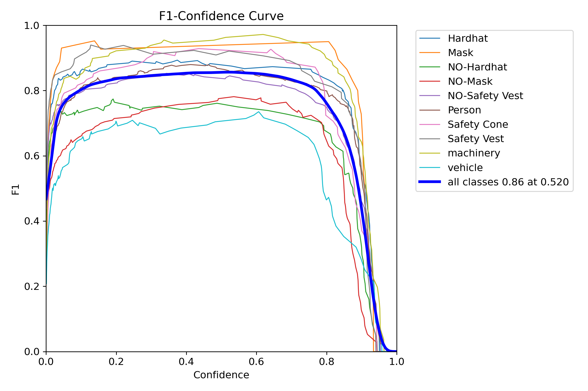

# 🚀 Model Comparison: YOLOv8n vs YOLOv8s vs YOLOv8m

## 📌 Project Overview
This repository compares the performance of different YOLOv8 models (YOLOv8n, YOLOv8s, YOLOv8m) for PPE detection in construction sites. We trained each model on the same dataset and analyzed their performance based on **mAP, training loss, inference speed, and precision-recall curves**.

---

## ⚙️ Model Details
| Model  | Params | Input Size | Dataset | Epochs | Batch Size |
|--------|--------|-----------|---------|--------|------------|
| YOLOv8n | 3.2M  | 640x640   | PPE Dataset | 85 | -1 |
| YOLOv8s | 11.2M | 640x640   | PPE Dataset | 100 | -1 |
| YOLOv8m | 25.9M | 640x640   | PPE Dataset | 50 | -1 |

### here -1 is used for auto batch selection which will be handled by cuda for effective utilization of GPU.
---

## 📈 Training Performance

### 🔥 **PR Curves of different models during training**
Here’s how the training PR curve evolved over time for each model:

| YOLOv8n | YOLOv8s | YOLOv8m |
|---------|---------|---------|
|  |  |  |

---

### 🔥 **F1 Curves of different models during validation**
Here’s how the training PR curve evolved over time for each model:

| YOLOv8n | YOLOv8s | YOLOv8m |
|---------|---------|---------|
|  |  |  |

---

### 🏆 **mAP (Mean Average Precision) Scores for training**
| Model  | mAP@50 | mAP@50-95 | Precision | Recall |
|--------|--------|----------|-----------|--------|
| YOLOv8n | 81.00% | 50.11% | 88.366% | 73.23% |
| YOLOv8s | 86.94% | 60.25% | 95.61% | 78.10% |
| YOLOv8m | 86.02% | 60.11% | 92.76% | 78.76% |

---
<!-- 
### ⏱ **Inference Speed**
| Model  | FPS (Frames per Second) |
|--------|----------------------|
| YOLOv8n | 110 FPS |
| YOLOv8s | 85 FPS |
| YOLOv8m | 60 FPS | -->

---

## 🔍 Key Observations
- **YOLOv8n** is the fastest but has lower accuracy. (Trained on 85 epochs) 
- **YOLOv8m** will have the highest accuracy but runs slower (trained on less number of epoch (50) as running 100 epochs could take much more time).  
- **YOLOv8s** offers a balance between speed and accuracy.  (Trained on 100 epochs)

---

## 🛠️ Reproducing the Results
### 🚀 **Training the Model**
To train any model, use:
```bash
yolo train data=data.yaml model=yolov8n.pt imgsz=640 epochs=50 batch=16
```

## Command to run streamlit application
- streamlit run main.py --server.fileWatcherType none
